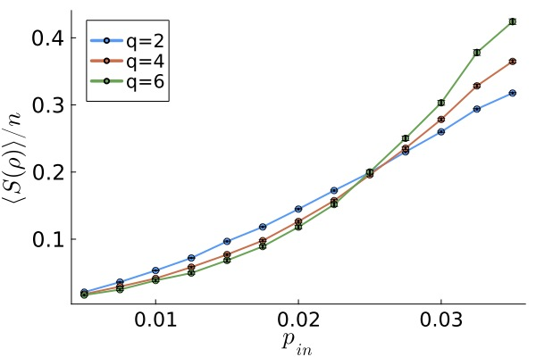
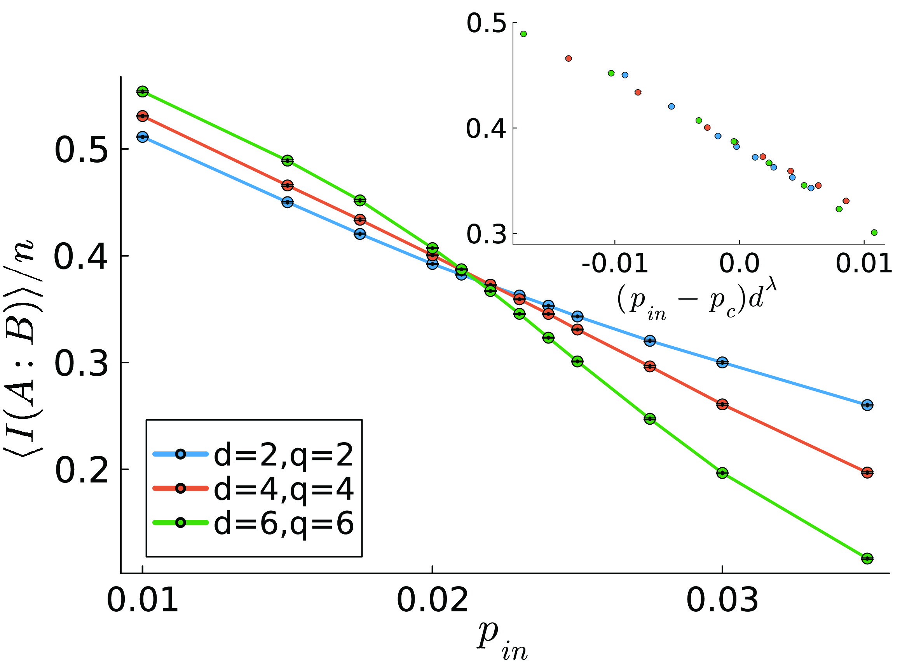

# Readme

## Codestate preparation simulation

Collect data using the command: 

```
julia --project=. ./state_prep_data.jl -l 48 -d 6 -q 2 -n 1000 -f "filename" -p 0.005 -a
```
This produces a csv file with one row that looks as follows:

| L | d | p | levels | num_samples | avg_entropy_1 | avg_entropy_2 | sem_entropy_1 | sem_entropy_2 |
| -------- | ------- | -------- | ------- | -------- | ------- | -------- | ------- | -------- |
| 48 | 6 | 0.005 | 2 | 1000 | ... | ... | ... | ... |

To collect all of the data in Figure 7 of arXiv:2311.17985 (shown below) using SLURM on the cluster, run:
```
sbatch --time=72:00:00 --mem=8gb state_prep_data.sh
```
which runs the state_prep_data.jl program for all of the parameter configurations in Figure 7. Each data point is saved in the same csv file and added as a row of the above table. 

To move this csv file from the cluster to a local folder, first cd into the desired folder and then run:

```
scp nelson1@nexusquics00.umiacs.umd.edu:data/state_prep_entropy_L_48_d_6_q_6_r_3_n_1000 .
```

To generate the plot, run
```
julia --project=. state_prep_plot.jl -f "filename" -r 2 4 6
```

To run state_prep_plot.jl with the same filename as ./state_prep_data.sh, use ./state_prep_plot.sh.

<figure>
    
    <figcaption>Figure 7 of arXiv:2311.17985.</figcaption>
</figure>

## Steane error correction simulation

Collect data using the command
```
julia --project=. ./steane_ec_data.jl -l 48 -d 6 -q 6 -r 3 -p 0.01 -n 4000 -a
```

This produces a csv file with one row for each sample (so 4000 rows in this case):

| L | d | r | p | q | samples | mi_1 | mi_2 | ... |
| -------- | ------- | -------- | ------- | -------- | ------- | -------- | ------- | -------- |
| 48 | 2 | 3 | 0.01 | 6 | 1 | ... | ... | ... | ... |
| 48 | 2 | 3 | 0.01 | 6 | 2 | ... | ... | ... | ... |
| 48 | 2 | 3 | 0.01 | 6 | ... | ... | ... | ... | ... |

To collect all of the data in Figure 9 of arXiv:2311.17985 (shown below) using SLURM on the cluster, run:
```
./steane_ec_data.sh
```

After copying to a local folder, compute the average and standard error mean of the samples with the command:
```
julia --project=. steane_ec_consolidate.jl -l 48 -p 0.01 0.015 0.0175 0.02 0.021 0.022 0.023 0.024 0.025 0.0275 0.03 0.035 -r 3 -d 2 4 6 -q 2 4 6
```

This produces a csv file with the name "mi_L_48_r_3.csv" of the form:

| L | d | r | p | num_samples | avg_mi | sem_mi |
| -------- | ------- | -------- | ------- | -------- | ------- | -------- |
| 48 | 6 | 3| 0.01 | 4000 | ... | ... |
| 48 | 6 | 3| 0.015 | 4000 | ... | ... |
| 48 | 6 | 3| ... | ... | ... | ... |

To generate the main plot of Figure 9 below run:

```
julia --project=. steane_ec_plot.jl -l 48 -r 3
```

To generate the finite-size scaling collapse shown in the inset of Figure 9, run:

```
julia mi_collapse.jl -l 48 -r 3
```
<figure>
    
    <figcaption>Figure 9 of arXiv:2311.17985.</figcaption>
</figure>